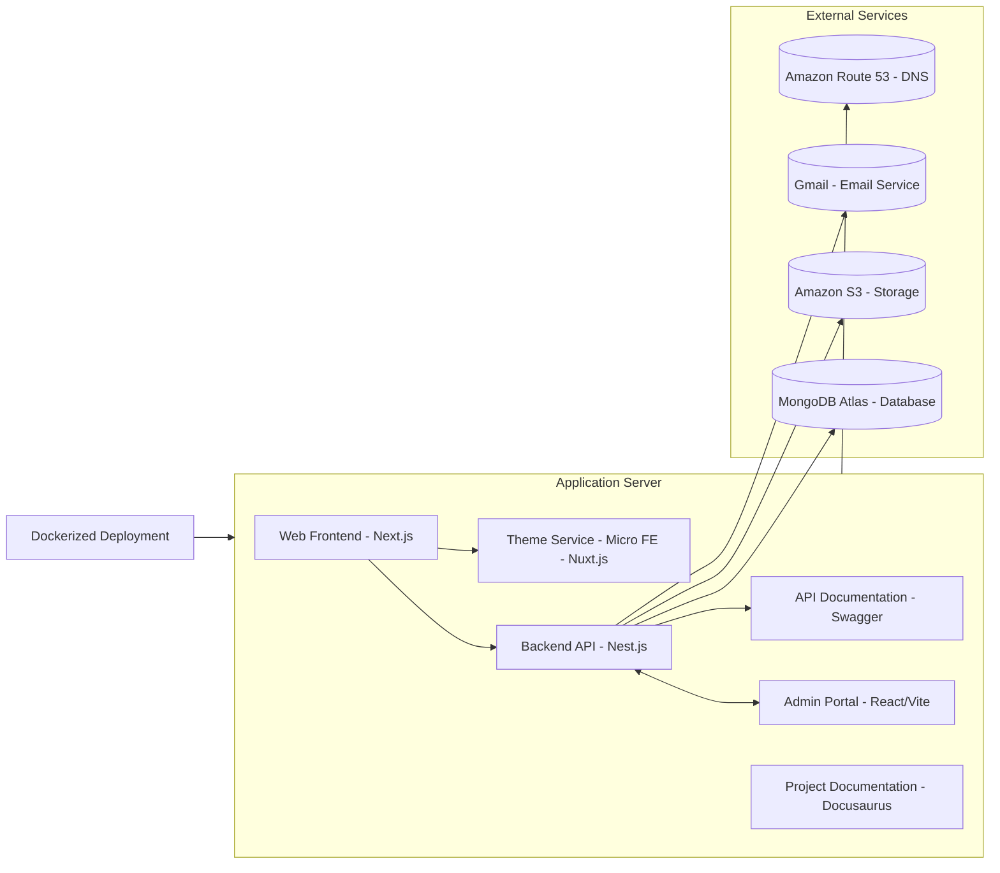

# daidev - Multi-tenant Portfolio Platform

**daidev** is a comprehensive multi-tenant portfolio platform designed to showcase personal themes, blogs, certificates, and contact functionality. It includes a public web app, an admin dashboard, and a robust backend, all built with modern technologies to ensure scalability, modularity, and user-friendly design.

## 🚀 Features

- **Public Web App**: Portfolio with Home, About, Certificates, Themes, Blogs, and Contact sections
- **Admin Dashboard**: Secure interface for managing content with role-based access
- **Multi-Tenancy**: Isolated data per user/tenant
- **i18n Support**: English and Vietnamese languages
- **Modern UI**: Responsive design with dark/light mode
- **Micro Frontend**: Nuxt.js integration for Theme Detail pages
- **Image Management**: Cloudinary integration
- **Email Service**: Resend integration with reCAPTCHA protection

## 🏗️ Architecture



## 🛠️ Tech Stack

### Backend
- **Nest.js**: API and Backend-for-Frontend layer
- **MongoDB**: Multi-tenant data storage
- **Resend**: Email service
- **Cloudinary**: Image storage and management

### Frontend
- **Next.js**: Main portfolio framework
- **Nuxt.js**: Theme Detail micro frontend
- **React**: Admin dashboard
- **Tailwind CSS**: Styling framework
- **TypeScript**: Type safety

### DevOps
- **Turborepo**: Monorepo management
- **Vercel**: Frontend hosting
- **Railway**: Backend hosting

## 🚀 Quick Start

### Prerequisites
- Node.js 18+
- MongoDB Atlas account
- Cloudinary account
- Resend account
- reCAPTCHA keys

### Installation

1. **Clone the repository**
   ```bash
   git clone <repository-url>
   cd daidev
   ```

2. **Install dependencies**
   ```bash
   npm install
   ```

3. **Set up environment variables**
   ```bash
   # Copy and configure environment files
   cp apps/api/.env.example apps/api/.env
   cp apps/web/.env.local.example apps/web/.env.local
   cp apps/admin/.env.local.example apps/admin/.env.local
   cp apps/theme-detail/.env.example apps/theme-detail/.env
   ```

4. **Start development servers**
   ```bash
   npm run dev
   ```

### Environment Variables

#### Backend (Nest.js)
```env
MONGODB_URI=mongodb+srv://<user>:<password>@cluster0.mongodb.net/daidev
RESEND_API_KEY=<resend-api-key>
CLOUDINARY_CLOUD_NAME=<cloudinary-cloud-name>
CLOUDINARY_API_KEY=<cloudinary-api-key>
CLOUDINARY_API_SECRET=<cloudinary-api-secret>
JWT_SECRET=<jwt-secret>
```

#### Frontend Web (Next.js)
```env
NEXT_PUBLIC_API_URL=http://localhost:3000/api
NEXT_PUBLIC_RECAPTCHA_SITE_KEY=<recaptcha-site-key>
NEXT_PUBLIC_CLOUDINARY_CLOUD_NAME=<cloudinary-cloud-name>
```

#### Admin Dashboard (React)
```env
REACT_APP_API_URL=http://localhost:3000/api
REACT_APP_CLOUDINARY_CLOUD_NAME=<cloudinary-cloud-name>
```

## 📱 Available Apps

- **Web App**: http://localhost:3001 (Next.js)
- **Theme Detail**: http://localhost:3002 (Nuxt.js)
- **Admin Dashboard**: http://localhost:3003 (React)
- **Backend API**: http://localhost:3000 (Nest.js)

## 🔧 Development

### Available Scripts

- `npm run dev` - Start all development servers
- `npm run build` - Build all applications
- `npm run lint` - Lint all applications
- `npm run test` - Run tests
- `npm run clean` - Clean build outputs

### Adding New Features

1. **Backend**: Add new modules in `apps/api/src/`
2. **Frontend**: Add new pages/components in respective apps
3. **Shared**: Add common utilities in `packages/shared/`

## 🚀 Deployment

### Frontend (Vercel)
- Deploy Next.js, Nuxt.js, and React apps to Vercel
- Configure environment variables in Vercel dashboard

### Backend (Railway)
- Deploy Nest.js app to Railway
- Connect MongoDB Atlas cluster
- Configure environment variables

## 🔒 Security Features

- **Multi-tenancy**: Data isolation with tenantId
- **Authentication**: JWT-based auth with Auth.js
- **Role-based Access**: Admin and viewer roles
- **reCAPTCHA**: Spam protection for contact forms
- **Input Validation**: Comprehensive validation with DTOs

## 🌐 Internationalization

The platform supports English and Vietnamese languages:
- Frontend: `next-i18next` for Next.js, `i18next` for React
- Backend: Nested language fields in MongoDB documents
- Database: Multi-language content storage

## 📊 Database Schema

Collections with multi-tenant support:
- **Users**: User profiles and authentication
- **Themes**: Portfolio themes with tags
- **Blogs**: Blog posts with content
- **Certificates**: User certificates
- **Tags**: Categorization system
- **Images**: Cloudinary metadata
- **ContactMessages**: Form submissions
- **SiteSettings**: Customizable site configuration

## 🔮 Future Roadmap

- **Bookmark/Like**: User interaction features
- **Search**: Full-text search capabilities
- **Theme Marketplace**: Sales and payment integration
- **Additional Languages**: Expand i18n support
- **Analytics**: User behavior tracking
- **Performance**: Advanced caching and optimization

## 🤝 Contributing

1. Fork the repository
2. Create a feature branch
3. Make your changes
4. Add tests if applicable
5. Submit a pull request

## 📄 License

This project is licensed under the MIT License.

## 🆘 Support

For support and questions:
- Create an issue in the repository
- Check the documentation in the `docs/` folder
- Review the API documentation

---

Built with ❤️ using modern web technologies 
