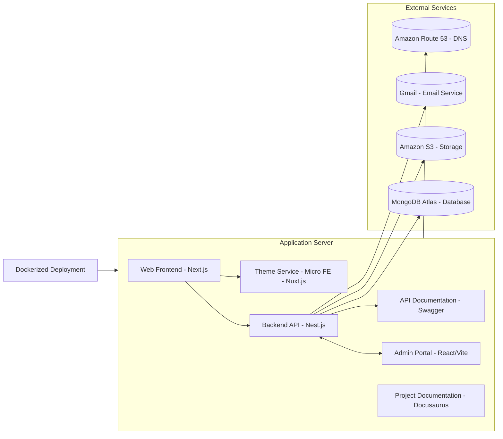

# daidev - Multi-tenant Portfolio Platform

**daidev** is a comprehensive multi-tenant portfolio platform designed to showcase personal themes, blogs, certificates, and contact functionality. It includes a public web app, an admin dashboard, and a robust backend, all built with modern technologies to ensure scalability, modularity, and user-friendly design.

## 🚀 Features

- **Public Web App**: Portfolio with Home, About, Certificates, Themes, Blogs, and Contact sections
- **Admin Dashboard**: Secure interface for managing content with role-based access
- **Multi-Tenancy**: Isolated data per user/tenant
- **i18n Support**: English and Vietnamese languages
- **Modern UI**: Responsive design with dark/light mode
- **Micro Frontend**: Nuxt.js integration for Theme Detail pages
- **Image Management**: Cloudinary integration
- **Email Service**: Resend integration with reCAPTCHA protection

## 🏗️ Architecture


Tôi sẽ scan thư mục root của dự án DaiDev để hiểu cách nó hoạt động. Hãy bắt đầu từ thư mục gốc:

```bash
cd /Users/dainguyen/Documents/project/daidev && pwd && ls -la
```
Bây giờ hãy xem các file cấu hình chính:

Read file: package.json
Read file: pnpm-workspace.yaml
Read file: docker-compose.yml
Bây giờ hãy xem cấu trúc thư mục apps:

```bash
ls -la apps/
```
Hãy xem file README để hiểu tổng quan:

Read file: README.md
Bây giờ hãy xem cấu trúc của từng app chính:

```bash
find apps/ -name "package.json" -exec echo "=== {} ===" \; -exec head -20 {} \;
```
Bây giờ hãy xem cấu trúc API để hiểu backend:

```bash
tree apps/api/src -I node_modules
```
Hãy xem file main.ts của API để hiểu cách khởi động:

Read file: apps/api/src/main.ts
Bây giờ hãy xem cấu trúc web app:

```bash
tree apps/web/src -I node_modules -L 3
```
Cuối cùng, hãy xem cấu trúc admin dashboard:

```bash
tree apps/admin/src -I node_modules -L 3
```
## 🏗️ **Tổng quan về Kiến trúc Dự án DaiDev**

Sau khi scan toàn bộ thư mục root, đây là cách dự án DaiDev hoạt động:

### 📁 **Cấu trúc Monorepo**
```
daidev/
├── apps/                    # Các ứng dụng chính
│   ├── api/                # Backend API (NestJS)
│   ├── web/                # Frontend chính (Next.js)
│   ├── admin/              # Admin dashboard (React + Vite)
│   ├── theme-detail/       # Micro frontend (Nuxt.js)
│   ├── docs/               # Tài liệu (Docusaurus)
│   ├── swagger-proxy/      # Swagger UI proxy
│   └── assets/             # Tài sản tĩnh
├── packages/               # Shared packages
├── deployment/             # Scripts triển khai
└── docker-compose.yml      # Cấu hình Docker
```

### �� **Cách hoạt động**

#### **1. Development Mode**
```bash
npm run dev  # Chạy tất cả services
```

#### **2. Production Mode**
```bash
docker-compose up -d  # Chạy với Docker
```

### ��️ **Kiến trúc Microservices**

#### **Backend (NestJS) - Port 3001**
- **API RESTful** với Swagger documentation
- **Multi-tenancy** support
- **JWT Authentication**
- **MongoDB** integration
- **CORS** cho tất cả subdomains
- **Modules**: Auth, Users, Themes, Blogs, Certificates, Tags, Images, etc.

#### **Frontend Web (Next.js) - Port 3003**
- **Portfolio website** chính
- **i18n** support (EN/VI)
- **Responsive design**
- **Dark/Light mode**
- **Pages**: Home, About, Portfolio, Blog, Contact, Resume

#### **Admin Dashboard (React) - Port 3002**
- **CRUD operations** cho tất cả entities
- **Role-based access**
- **Form management**
- **Real-time updates**

#### **Theme Detail (Nuxt.js) - Port 3004**
- **Micro frontend** cho theme preview
- **SSR** support
- **Dynamic routing**

#### **Documentation (Docusaurus) - Port 4002**
- **Project documentation**
- **API guides**
- **Deployment guides**

#### **Swagger UI (Express) - Port 4001**
- **API documentation**
- **Interactive testing**

### 🐳 **Docker Architecture**
- **MongoDB**: Database container
- **Nginx**: Reverse proxy + load balancer
- **Multi-container** setup với networking
- **Volume persistence** cho data
- **Environment variables** configuration

### 🔄 **Data Flow**
1. **User** truy cập website
2. **Nginx** route requests đến appropriate service
3. **Frontend** gọi API qua HTTP
4. **API** xử lý business logic
5. **MongoDB** lưu trữ data
6. **External services** (Cloudinary, Resend) cho media & email

### 🛠️ **Tech Stack Summary**
- **Monorepo**: Turborepo + pnpm
- **Backend**: NestJS + MongoDB + JWT
- **Frontend**: Next.js + React + Nuxt.js
- **Styling**: Tailwind CSS
- **Deployment**: Docker + Nginx
- **External**: Cloudinary + Resend + reCAPTCHA

Đây là một **full-stack portfolio platform** với kiến trúc microservices hiện đại, hỗ trợ multi-tenancy và có thể scale dễ dàng! 🚀