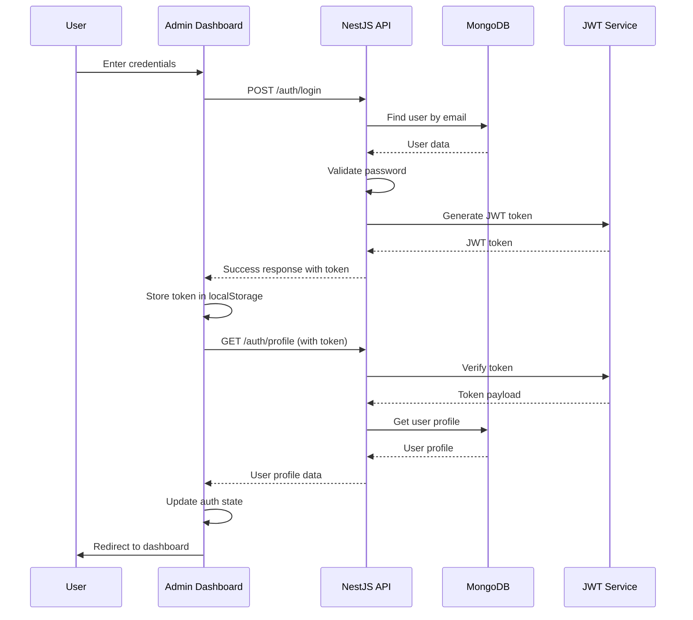

# Admin Login Flow Guide

This guide provides a comprehensive overview of the authentication flow between the Admin Dashboard and the API backend, including the complete login process from user input to successful authentication.

## 🔄 Authentication Flow Overview



## 🏗️ Architecture Components

### Frontend (Admin Dashboard)
- **React + TypeScript**: Main framework
- **Vite**: Build tool
- **Tailwind CSS**: Styling
- **React Router**: Navigation
- **Axios**: HTTP client
- **Context API**: State management

### Backend (NestJS API)
- **NestJS**: Framework
- **JWT**: Token-based authentication
- **bcrypt**: Password hashing
- **MongoDB**: Database
- **Mongoose**: ODM

## 📋 Step-by-Step Login Flow

### 1. User Interface (Login Form)

#### Login Component (`apps/admin/src/pages/Login.tsx`)
```typescript
import React, { useState } from "react";
import { useNavigate } from "react-router-dom";
import { useAuth } from "../hooks/useAuth";

const Login: React.FC = () => {
  const [email, setEmail] = useState("");
  const [password, setPassword] = useState("");
  const [error, setError] = useState("");
  const [loading, setLoading] = useState(false);

  const { login } = useAuth();
  const navigate = useNavigate();

  const handleSubmit = async (e: React.FormEvent) => {
    e.preventDefault();
    setError("");
    setLoading(true);

    try {
      await login({ email, password });
      navigate("/");
    } catch (err: any) {
      setError(
        err.response?.data?.message || "Login failed. Please try again."
      );
    } finally {
      setLoading(false);
    }
  };

  return (
    <form onSubmit={handleSubmit}>
      <input
        type="email"
        value={email}
        onChange={(e) => setEmail(e.target.value)}
        placeholder="Enter your email"
        required
      />
      <input
        type="password"
        value={password}
        onChange={(e) => setPassword(e.target.value)}
        placeholder="Enter your password"
        required
      />
      <button type="submit" disabled={loading}>
        {loading ? "Signing in..." : "Sign in"}
      </button>
    </form>
  );
};
```

### 2. Authentication Hook

#### useAuth Hook (`apps/admin/src/hooks/useAuth.tsx`)
```typescript
import { useState, useEffect, createContext, useContext } from 'react';
import { authAPI } from '../services/api';
import { User, LoginCredentials } from '../types/api';

interface AuthContextType {
  user: User | null;
  login: (credentials: LoginCredentials) => Promise<void>;
  logout: () => Promise<void>;
  loading: boolean;
}

export const AuthProvider: React.FC<{ children: React.ReactNode }> = ({ children }) => {
  const [user, setUser] = useState<User | null>(null);
  const [loading, setLoading] = useState(true);

  // Initialize auth state on app load
  useEffect(() => {
    const initAuth = async () => {
      const token = localStorage.getItem('access_token');
      if (token) {
        try {
          const userData = await authAPI.getProfile();
          setUser(userData);
        } catch (error) {
          console.error('Failed to get profile:', error);
          localStorage.removeItem('access_token');
          localStorage.removeItem('user');
        }
      }
      setLoading(false);
    };

    initAuth();
  }, []);

  const login = async (credentials: LoginCredentials) => {
    try {
      const response = await authAPI.login(credentials);
      localStorage.setItem('access_token', response.access_token);
      localStorage.setItem('user', JSON.stringify(response.user));
      setUser(response.user as User);
    } catch (error) {
      console.error('Login failed:', error);
      throw error;
    }
  };

  const logout = async () => {
    try {
      await authAPI.logout();
    } catch (error) {
      console.error('Logout failed:', error);
    } finally {
      setUser(null);
      localStorage.removeItem('access_token');
      localStorage.removeItem('user');
    }
  };

  return (
    <AuthContext.Provider value={{ user, login, logout, loading }}>
      {children}
    </AuthContext.Provider>
  );
};
```

### 3. API Service Layer

#### Auth API Service (`apps/admin/src/services/api.ts`)
```typescript
import axios from 'axios';

const API_BASE_URL = import.meta.env.VITE_API_URL || 'http://localhost:3001/api/v1';

// Create axios instance with interceptors
const api = axios.create({
  baseURL: API_BASE_URL,
  headers: {
    'Content-Type': 'application/json',
  },
});

// Add auth token to requests
api.interceptors.request.use((config) => {
  const token = localStorage.getItem('access_token');
  if (token) {
    config.headers.Authorization = `Bearer ${token}`;
  }
  return config;
});

// Global error handler
api.interceptors.response.use(
  (response) => {
    if (response.data && response.data.success === false) {
      window.dispatchEvent(
        new CustomEvent("app-error", {
          detail: response.data.message || "Có lỗi xảy ra!",
        })
      );
      return Promise.reject(new Error(response.data.message || "Có lỗi xảy ra!"));
    }
    return response;
  },
  (error) => {
    const msg = error?.response?.data?.message || error.message || 'Request error';
    window.dispatchEvent(new CustomEvent('app-error', { detail: msg }));
    return Promise.reject(error);
  }
);

// Auth API methods
export const authAPI = {
  login: async (credentials: LoginCredentials): Promise<AuthResponse> => {
    const response = await api.post<AuthResponse>('/auth/login', credentials);
    return response.data.data;
  },
  
  logout: async (): Promise<void> => {
    await api.post('/auth/logout');
    localStorage.removeItem('access_token');
    localStorage.removeItem('user');
  },
  
  getProfile: async (): Promise<User> => {
    const response = await api.get<User>('/auth/profile');
    return response.data.data;
  },
};
```

### 4. Backend Authentication Controller

#### Auth Controller (`apps/api/src/auth/auth.controller.ts`)
```typescript
import { Controller, Post, Body, UseGuards, Request, Get, HttpCode, HttpStatus } from '@nestjs/common';
import { ApiTags, ApiOperation, ApiResponse, ApiBearerAuth } from '@nestjs/swagger';
import { AuthService } from './auth.service';
import { LoginDto, RegisterDto } from './dto/auth.dto';
import { JwtAuthGuard } from './guards/jwt-auth.guard';

@ApiTags('Auth')
@Controller('auth')
export class AuthController {
  constructor(private authService: AuthService) {}
  
  @Post('login')
  @HttpCode(HttpStatus.OK)
  @ApiOperation({ summary: 'User login' })
  @ApiResponse({ status: 200, description: 'Login successful' })
  @ApiResponse({ status: 401, description: 'Unauthorized' })
  async login(@Body() loginDto: LoginDto) {
    const result = await this.authService.login(loginDto);
    if (!result) {
      return { success: false, data: null, message: 'Login failed' };
    }
    return { success: true, data: result, message: 'Login successful' };
  }

  @Get('profile')
  @UseGuards(JwtAuthGuard)
  @ApiOperation({ summary: 'Get user profile' })
  @ApiResponse({ status: 200, description: 'Profile retrieved successfully' })
  @ApiBearerAuth()
  async getProfile(@Request() req: any) {
    const profile = await this.authService.getProfile(req.user.userId);
    if (!profile) {
      return { success: false, data: null, message: 'Profile not found' };
    }
    return { success: true, data: profile };
  }
}
```

### 5. Backend Authentication Service

#### Auth Service (`apps/api/src/auth/auth.service.ts`)
```typescript
import { Injectable, UnauthorizedException, ConflictException } from '@nestjs/common';
import { JwtService } from '@nestjs/jwt';
import { UsersService } from '../users/users.service';
import * as bcrypt from 'bcryptjs';

@Injectable()
export class AuthService {
  constructor(
    private usersService: UsersService,
    private jwtService: JwtService,
  ) {}

  async login(loginDto: { email: string; password: string }) {
    // 1. Find user by email
    const user = await this.usersService.findByEmail(loginDto.email);
    if (!user) {
      throw new UnauthorizedException('Invalid credentials');
    }

    // 2. Validate password
    const isPasswordValid = await bcrypt.compare(loginDto.password, user.password);
    if (!isPasswordValid) {
      throw new UnauthorizedException('Invalid credentials');
    }

    // 3. Generate JWT payload
    const payload = { 
      sub: user._id, 
      email: user.email, 
      role: user.role, 
      tenantId: user.tenantId 
    };
    
    // 4. Sign JWT token
    const token = this.jwtService.sign(payload);
    
    // 5. Return response
    return {
      access_token: token,
      user: {
        id: user._id,
        email: user.email,
        role: user.role,
        tenantId: user.tenantId
      }
    };
  }

  async getProfile(userId: string) {
    const user = await this.usersService.findById(userId);
    if (!user) {
      throw new UnauthorizedException('User not found');
    }
    
    const { password, ...result } = user.toObject();
    return result;
  }
}
```

## 🔐 JWT Token Structure

### Token Payload
```json
{
  "header": {
    "alg": "HS256",
    "typ": "JWT"
  },
  "payload": {
    "sub": "507f1f77bcf86cd799439011",
    "email": "admin@daidev.com",
    "role": "admin",
    "tenantId": "default",
    "iat": 1640995200,
    "exp": 1641600000
  }
}
```

### Token Configuration
```typescript
// JWT Module Configuration
JwtModule.register({
  secret: process.env.JWT_SECRET,
  signOptions: { 
    expiresIn: process.env.JWT_EXPIRES_IN || '7d' 
  },
})
```

## 🛡️ Security Features

### 1. Password Hashing
```typescript
// Password hashing with bcrypt
const hashedPassword = await bcrypt.hash(password, 10);

// Password verification
const isPasswordValid = await bcrypt.compare(password, hashedPassword);
```

### 2. JWT Guard Protection
```typescript
// JWT Auth Guard
@Injectable()
export class JwtAuthGuard extends AuthGuard('jwt') {
  canActivate(context: ExecutionContext) {
    return super.canActivate(context);
  }

  handleRequest(err: any, user: any, info: any) {
    if (err || !user) {
      throw err || new UnauthorizedException();
    }
    return user;
  }
}
```

### 3. Request Interceptors
```typescript
// Add token to all requests
api.interceptors.request.use((config) => {
  const token = localStorage.getItem('access_token');
  if (token) {
    config.headers.Authorization = `Bearer ${token}`;
  }
  return config;
});
```

## 📊 Data Flow Details

### 1. Login Request Flow
```typescript
// 1. User submits login form
const handleSubmit = async (e: React.FormEvent) => {
  e.preventDefault();
  await login({ email, password });
};

// 2. Auth hook calls API
const login = async (credentials: LoginCredentials) => {
  const response = await authAPI.login(credentials);
  localStorage.setItem('access_token', response.access_token);
  setUser(response.user);
};

// 3. API service makes HTTP request
const login = async (credentials: LoginCredentials): Promise<AuthResponse> => {
  const response = await api.post<AuthResponse>('/auth/login', credentials);
  return response.data.data;
};
```

### 2. Profile Fetching Flow
```typescript
// 1. App initialization
useEffect(() => {
  const initAuth = async () => {
    const token = localStorage.getItem('access_token');
    if (token) {
      const userData = await authAPI.getProfile();
      setUser(userData);
    }
  };
  initAuth();
}, []);

// 2. API service with token
const getProfile = async (): Promise<User> => {
  const response = await api.get<User>('/auth/profile');
  return response.data.data;
};
```

### 3. Protected Route Access
```typescript
// Route protection with auth state
const ProtectedRoute = ({ children }: { children: React.ReactNode }) => {
  const { user, loading } = useAuth();
  
  if (loading) {
    return <LoadingSpinner />;
  }
  
  if (!user) {
    return <Navigate to="/login" />;
  }
  
  return <>{children}</>;
};
```

## 🚨 Error Handling

### Frontend Error Handling
```typescript
// Login error handling
try {
  await login({ email, password });
  navigate("/");
} catch (err: any) {
  setError(
    err.response?.data?.message || "Login failed. Please try again."
  );
}

// Global error interceptor
api.interceptors.response.use(
  (response) => response,
  (error) => {
    const msg = error?.response?.data?.message || error.message || 'Request error';
    window.dispatchEvent(new CustomEvent('app-error', { detail: msg }));
    return Promise.reject(error);
  }
);
```

### Backend Error Handling
```typescript
// Authentication errors
if (!user) {
  throw new UnauthorizedException('Invalid credentials');
}

if (!isPasswordValid) {
  throw new UnauthorizedException('Invalid credentials');
}

// Response format
return { 
  success: false, 
  data: null, 
  message: 'Login failed' 
};
```

## 🔄 Logout Flow

### 1. Frontend Logout
```typescript
const logout = async () => {
  try {
    await authAPI.logout();
  } catch (error) {
    console.error('Logout failed:', error);
  } finally {
    setUser(null);
    localStorage.removeItem('access_token');
    localStorage.removeItem('user');
  }
};
```

### 2. Backend Logout
```typescript
@Post('logout')
@UseGuards(JwtAuthGuard)
async logout(@Request() req: any) {
  await this.authService.logout(req.user.userId);
  return { success: true, data: null, message: 'Logout successful' };
}

async logout(userId: string) {
  // In a real application, you might want to blacklist the token
  return { message: 'Logged out successfully' };
}
```

## 📋 Authentication Checklist

### Frontend Setup
- [ ] Login form component created
- [ ] Auth context provider implemented
- [ ] API service configured with interceptors
- [ ] Protected routes implemented
- [ ] Error handling configured
- [ ] Loading states managed

### Backend Setup
- [ ] Auth controller implemented
- [ ] Auth service with JWT integration
- [ ] Password hashing with bcrypt
- [ ] JWT guard for protected routes
- [ ] User service for database operations
- [ ] Error handling and validation

### Security Measures
- [ ] JWT tokens with expiration
- [ ] Password hashing
- [ ] CORS configuration
- [ ] Rate limiting
- [ ] Input validation
- [ ] Error message sanitization

### Testing
- [ ] Login flow tested
- [ ] Token validation tested
- [ ] Protected routes tested
- [ ] Error scenarios tested
- [ ] Logout flow tested
- [ ] Token expiration handled 