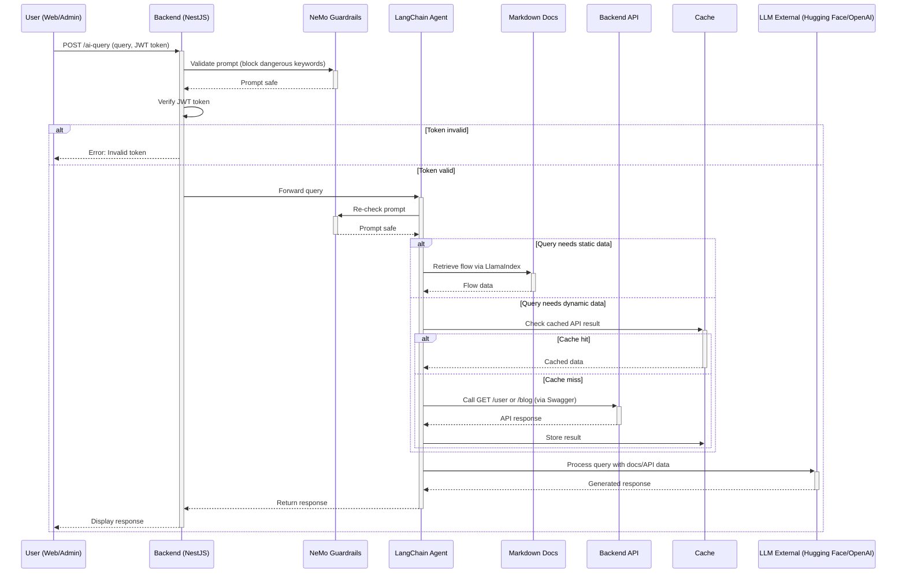

# AI Query Flow Documentation

## Overview

This document describes the architecture and flow of the AI-powered query system integrated into our platform. The system leverages external Large Language Models (LLMs) such as Hugging Face or OpenAI, combined with our backend APIs and documentation, to provide intelligent, context-aware answers to user queries.

---

## Sequence Diagram

---

## Key Components

- **User (Web/Admin):** Initiates a query from the frontend, providing a JWT token for authentication.
- **Backend (NestJS):** Receives the query, validates the token, and ensures prompt safety using NeMo Guardrails.
- **NeMo Guardrails:** Filters out dangerous or malicious prompts to prevent prompt injection and unsafe API calls.
- **LangChain Agent:** Orchestrates the query, deciding whether to fetch static documentation or call backend APIs for dynamic data.
- **Markdown Docs:** Stores static flow and process documentation, accessible via LlamaIndex.
- **Backend API:** Provides dynamic data (e.g., user info, blog posts) via RESTful endpoints, described in Swagger.
- **Cache:** Stores recent API results to reduce latency and external API costs.
- **LLM External:** Processes the query, combining documentation and API data to generate a natural language response.

---

## Best Practices

- **Security:** All API calls are authenticated and authorized using JWT tokens. Only whitelisted API endpoints are accessible to the AI agent.
- **Prompt Safety:** NeMo Guardrails are used at multiple stages to prevent prompt injection and block dangerous instructions.
- **Cost Optimization:** Caching is implemented to minimize redundant API calls and reduce external LLM usage.
- **Documentation-Driven:** The AI agent prioritizes answers from documentation before making API calls, ensuring accurate and up-to-date responses.
- **Error Handling:** The system gracefully handles invalid tokens, API errors, and missing data, providing user-friendly error messages.

---

## Example Query

**User:**  
"List all themes related to 'love'."

**AI Flow:**  
1. The query is received and validated.
2. The agent checks documentation for relevant information.
3. If dynamic data is needed, the agent calls the `/themes` API with appropriate filters.
4. The LLM combines the results and returns a natural language answer.

---

## References

- [LangChain OpenAPI Toolkit](https://python.langchain.com/docs/integrations/toolkits/openapi)
- [LlamaIndex](https://www.llamaindex.ai/)
- [NeMo Guardrails](https://github.com/NVIDIA/NeMo-Guardrails)
- [Hugging Face Inference API](https://huggingface.co/inference-api)
- [NestJS Documentation](https://docs.nestjs.com/)

---
