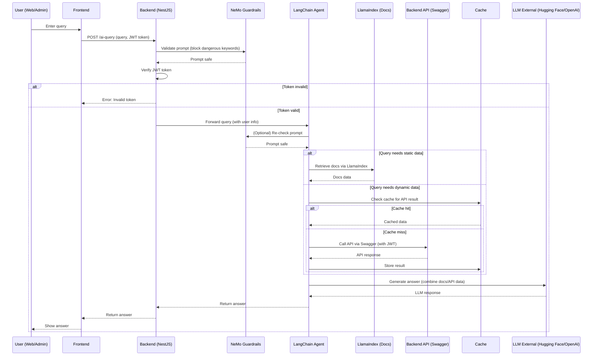

# AI Integration Flow

## Overview

This document describes the architecture and step-by-step flow for integrating AI-powered query capabilities into our system. The solution leverages external LLMs (such as Hugging Face or OpenAI), LangChain for orchestration, LlamaIndex for documentation retrieval, NeMo Guardrails for prompt safety, and our backend APIs for dynamic data.

---

## Sequence Diagram

---

## Key Components

- **User (Web/Admin):** Initiates a query from the frontend, providing a JWT token for authentication.
- **Frontend:** Sends the query and token to the backend endpoint `/ai-query`.
- **Backend (NestJS):** Validates the token, checks prompt safety with NeMo Guardrails, and forwards the query to the LangChain agent.
- **NeMo Guardrails:** Filters out dangerous or malicious prompts to prevent prompt injection and unsafe API calls.
- **LangChain Agent:** Orchestrates the query, deciding whether to fetch static documentation (via LlamaIndex) or call backend APIs (via Swagger) for dynamic data.
- **LlamaIndex (Docs):** Retrieves and summarizes information from Markdown documentation.
- **Backend API (Swagger):** Provides dynamic data (e.g., user info, blog posts) via RESTful endpoints.
- **Cache:** Stores recent API results to reduce latency and external LLM usage.
- **LLM External:** Processes the query, combining documentation and API data to generate a natural language response.

---

## Best Practices

- **Security:** All API calls are authenticated and authorized using JWT tokens. Only whitelisted API endpoints are accessible to the AI agent.
- **Prompt Safety:** NeMo Guardrails are used at multiple stages to prevent prompt injection and block dangerous instructions.
- **Cost Optimization:** Caching is implemented to minimize redundant API calls and reduce external LLM usage.
- **Documentation-Driven:** The AI agent prioritizes answers from documentation before making API calls, ensuring accurate and up-to-date responses.
- **Error Handling:** The system gracefully handles invalid tokens, API errors, and missing data, providing user-friendly error messages.

---

## Example Query

**User:**  
"List all themes related to 'love'."

**AI Flow:**  
1. The query is received and validated.
2. The agent checks documentation for relevant information.
3. If dynamic data is needed, the agent calls the `/themes` API with appropriate filters.
4. The LLM combines the results and returns a natural language answer.

---

## References

- [LangChain OpenAPI Toolkit](https://python.langchain.com/docs/integrations/toolkits/openapi)
- [LlamaIndex](https://www.llamaindex.ai/)
- [NeMo Guardrails](https://github.com/NVIDIA/NeMo-Guardrails)
- [Hugging Face Inference API](https://huggingface.co/inference-api)
- [NestJS Documentation](https://docs.nestjs.com/)

---