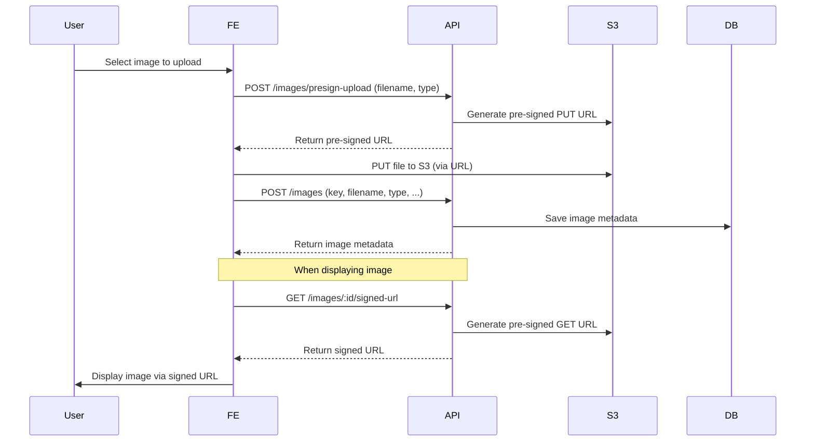

# S3 Image Upload & Secure Display Flow

## 1. Overview
This process enables secure image uploads to AWS S3, without exposing credentials, without public buckets, and only displays images via signed URLs with expiration.

## 2. Overall Flow

### A. Upload Image to S3
1. **User selects an image** in the Admin UI.
2. **Frontend** sends a request to the backend API to get a **pre-signed S3 upload URL** (POST `/images/presign-upload`).
   - Backend generates a pre-signed PUT URL with upload permission and returns it to the FE.
3. **Frontend** uploads the file directly to S3 using the pre-signed URL (PUT).
4. After a successful upload, the FE sends metadata (filename, key, type, etc.) to the backend API to save image info in the DB (POST `/images`).
5. Backend saves image info (key, url, type, user, ...) in the `images` collection.

### B. Display Image from S3 (signed URL)
1. When an image needs to be displayed (on web/app), the FE calls the backend API to get a **signed URL** (GET `/images/:id/signed-url` or `/images/signed-url?key=...`).
   - Backend generates a signed GET URL with a short expiration (e.g., 5 minutes) and returns it to the FE.
2. FE uses this signed URL to render the image (avoiding public bucket/key exposure).

---

## 3. API Endpoints

### A. Upload
- `POST /images/presign-upload`
  - Body: `{ filename, filetype }`
  - Response: `{ url, key }` (pre-signed PUT URL)
- `PUT` (FE uploads file to S3 via the above URL)
- `POST /images`
  - Body: `{ key, filename, filetype, ... }`
  - Response: `{ image }` (metadata saved in DB)

### B. Display
- `GET /images/:id/signed-url` or `GET /images/signed-url?key=...`
  - Response: `{ url }` (pre-signed GET URL)
- FE uses this URL to render ``

---

## 4. Flow Diagram (Mermaid)

---

## 5. Benefits
- No AWS credentials exposure, no public bucket.
- Can control access rights and URL expiration.
- Performance optimized: upload/download directly to S3, backend only grants permission.

---

## 6. Technical Requirements
- Backend: AWS SDK (S3), endpoints to generate pre-signed URLs (PUT/GET), save metadata to DB.
- Frontend: UI for file selection, upload via pre-signed URL, save metadata, fetch signed URL for image rendering.

---

## 7. Implementation Notes
- Can be extended for video/other files.
- Can add authentication, authorization for signed URL access.
- Can auto-delete S3 file when DB metadata is deleted.