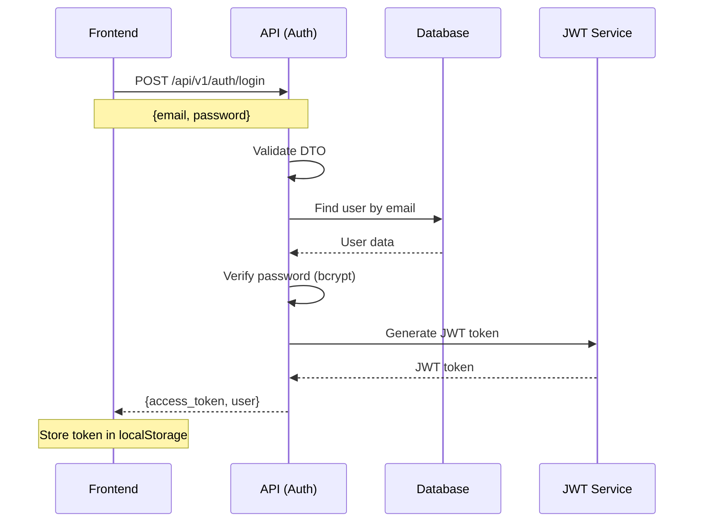
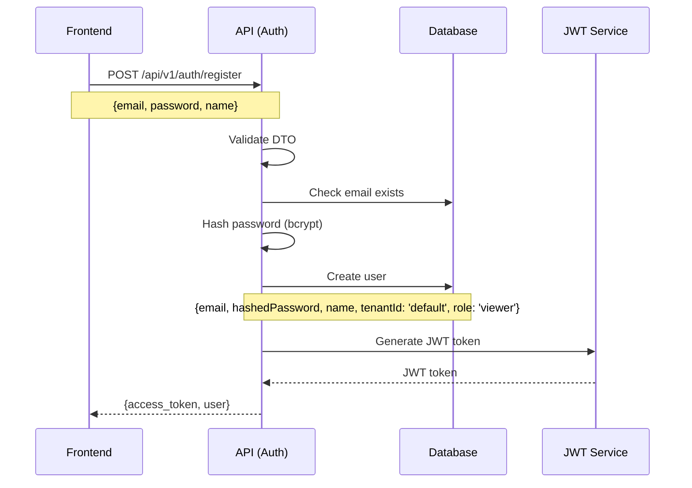
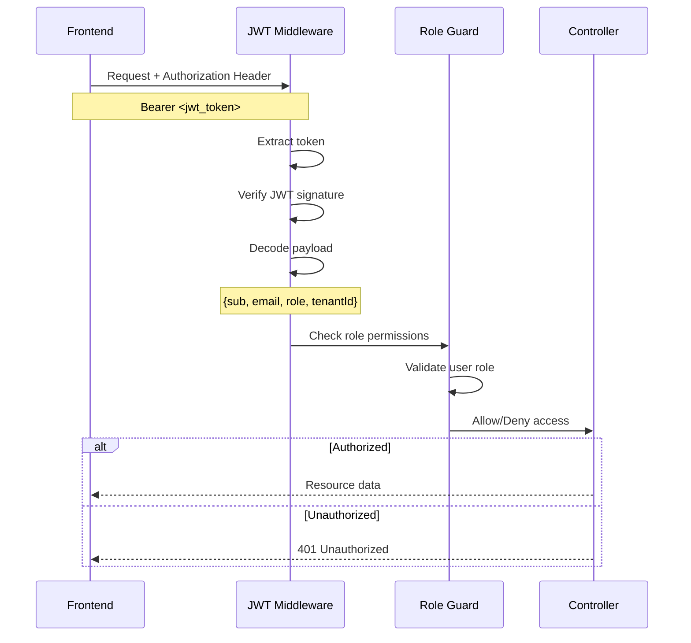
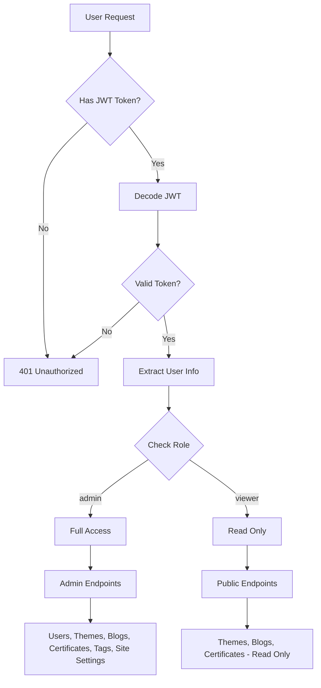

# 🔐 Authentication & Authorization Flow

## 📋 Tổng quan hệ thống

```
┌─────────────────┐    ┌─────────────────┐    ┌─────────────────┐
│   Frontend Apps │    │   API Gateway   │    │   Database      │
│                 │    │   (NestJS)      │    │   (MongoDB)     │
│ • Web App       │    │                 │    │                 │
│ • Admin Panel   │    │ • Auth Module   │    │ • Users         │
│ • Theme Detail  │    │ • JWT Guard     │    │ • Themes        │
│                 │    │ • Role Guard    │    │ • Blogs         │
└─────────────────┘    └─────────────────┘    └─────────────────┘
```

```
┌─────────────┐    ┌─────────────┐    ┌─────────────┐    ┌─────────────┐
│   Frontend  │    │     API     │    │  Database   │    │   Response  │
│  (Admin/Web)│    │  (NestJS)   │    │  (MongoDB)  │    │             │
└─────────────┘    └─────────────┘    └─────────────┘    └─────────────┘
       │                   │                   │                   │
       │ 1. POST /auth/login│                   │                   │
       │ {email, password} │                   │                   │
       │──────────────────▶│                   │                   │
       │                   │ 2. Validate input │                   │
       │                   │ (DTO validation)  │                   │
       │                   │──────────────────▶│                   │
       │                   │ 3. Find user by   │                   │
       │                   │ email + tenantId  │                   │
       │                   │──────────────────▶│                   │
       │                   │                   │ 4. Query user     │
       │                   │                   │ collection        │
       │                   │                   │◀──────────────────│
       │                   │ 5. Verify password│                   │
       │                   │ (bcrypt.compare)  │                   │
       │                   │◀──────────────────│                   │
       │                   │ 6. Generate JWT   │                   │
       │                   │ token             │                   │
       │                   │◀──────────────────│                   │
       │ 7. Return token   │                   │                   │
       │ + user info       │                   │                   │
       │◀──────────────────│                   │                   │
```

## 🔑 1. Authentication Flow (Đăng nhập)

### 1.1 Login Process


### 1.2 Register Process


## 🛡️ 2. Authorization Flow (Phân quyền)

### 2.1 JWT Authentication Middleware


### 2.2 Role-Based Access Control (RBAC)


## 🏗️ 3. System Architecture

### 3.1 Multi-Tenant Structure
```
┌─────────────────────────────────────────────────────────────┐
│                    Multi-Tenant System                      │
├─────────────────────────────────────────────────────────────┤
│  Tenant: default                                            │
│  ├── Users: [admin@daidev.com, test@example.com]           │
│  ├── Themes: [Modern Portfolio, Creative Portfolio]        │
│  ├── Blogs: [Getting Started with Web Development]         │
│  ├── Certificates: [React Developer Certificate]           │
│  ├── Tags: [JavaScript, React, Node.js]                    │
│  └── Site Settings: [Header, Menu, Footer]                 │
├─────────────────────────────────────────────────────────────┤
│  Tenant: admin-tenant                                       │
│  └── Users: [admin@daidev.com]                             │
└─────────────────────────────────────────────────────────────┘
```

### 3.2 API Endpoints Security
```
┌─────────────────────────────────────────────────────────────┐
│                    API Security Matrix                      │
├─────────────────────────────────────────────────────────────┤
│  Public Endpoints (No Auth Required)                       │
│  ├── POST /api/v1/auth/login                               │
│  ├── POST /api/v1/auth/register                            │
│  ├── GET  /api/v1/health                                   │
│  └── GET  /api/v1/themes (published only)                  │
├─────────────────────────────────────────────────────────────┤
│  Protected Endpoints (JWT Required)                        │
│  ├── GET  /api/v1/auth/profile                             │
│  ├── POST /api/v1/auth/logout                              │
│  ├── GET  /api/v1/users                                    │
│  ├── GET  /api/v1/blogs                                    │
│  ├── GET  /api/v1/certificates                             │
│  └── GET  /api/v1/tags                                     │
├─────────────────────────────────────────────────────────────┤
│  Admin Only Endpoints (Role: admin)                        │
│  ├── POST /api/v1/users                                    │
│  ├── PUT  /api/v1/users/:id                                │
│  ├── DELETE /api/v1/users/:id                              │
│  ├── POST /api/v1/themes                                   │
│  ├── PUT  /api/v1/themes/:id                               │
│  ├── DELETE /api/v1/themes/:id                             │
│  ├── POST /api/v1/blogs                                    │
│  ├── PUT  /api/v1/blogs/:id                                │
│  ├── DELETE /api/v1/blogs/:id                              │
│  ├── POST /api/v1/certificates                             │
│  ├── PUT  /api/v1/certificates/:id                         │
│  ├── DELETE /api/v1/certificates/:id                       │
│  ├── POST /api/v1/tags                                     │
│  ├── PUT  /api/v1/tags/:id                                 │
│  ├── DELETE /api/v1/tags/:id                               │
│  ├── GET  /api/v1/contact-messages                         │
│  ├── PUT  /api/v1/contact-messages/:id/mark-read           │
│  ├── PUT  /api/v1/contact-messages/:id/mark-replied        │
│  ├── GET  /api/v1/site-settings                            │
│  ├── POST /api/v1/site-settings                            │
│  ├── PUT  /api/v1/site-settings/:id                        │
│  └── DELETE /api/v1/site-settings/:id                      │
└─────────────────────────────────────────────────────────────┘
```

## 🔧 4. Implementation Details

### 4.1 JWT Token Structure
```json
{
  "sub": "user_id",
  "email": "user@example.com",
  "role": "admin|viewer",
  "tenantId": "default",
  "iat": 1640995200,
  "exp": 1641600000
}
```

### 4.2 User Roles & Permissions
```typescript
enum UserRole {
  ADMIN = 'admin',
  VIEWER = 'viewer'
}

interface UserPermissions {
  admin: {
    users: ['create', 'read', 'update', 'delete'],
    themes: ['create', 'read', 'update', 'delete'],
    blogs: ['create', 'read', 'update', 'delete'],
    certificates: ['create', 'read', 'update', 'delete'],
    tags: ['create', 'read', 'update', 'delete'],
    contactMessages: ['read', 'update'],
    siteSettings: ['create', 'read', 'update', 'delete']
  },
  viewer: {
    themes: ['read'],
    blogs: ['read'],
    certificates: ['read'],
    tags: ['read']
  }
}
```

### 4.3 Frontend Authentication State
```typescript
interface AuthState {
  isAuthenticated: boolean;
  user: {
    id: string;
    email: string;
    role: string;
    tenantId: string;
    profile: {
      name: string;
      bio: { en: string; vi: string };
      avatar: string;
      socialLinks: {
        github?: string;
        linkedin?: string;
        twitter?: string;
      };
    };
  } | null;
  token: string | null;
  loading: boolean;
}
```

## 🚨 5. Current Issues & Solutions

### 5.1 Issues Identified
1. **Missing JWT Guard**: Controllers require authentication but no guard is applied
2. **Missing Role Guard**: Admin endpoints not protected
3. **Missing User Context**: `req.user` is undefined in controllers
4. **Tenant Isolation**: No tenant-based data filtering

### 5.2 Error Patterns
```
❌ Cannot read properties of undefined (reading 'tenantId')
❌ Cannot read properties of undefined (reading 'userId')
❌ Admin access required
```

### 5.3 Solutions Needed
1. **Implement JWT Strategy** with Passport
2. **Add JWT Guard** to protected endpoints
3. **Add Role Guard** for admin-only endpoints
4. **Implement Tenant Middleware** for data isolation
5. **Add Request Context** to include user info

## 📝 6. Next Steps

### 6.1 API Implementation
- [ ] Create JWT Strategy
- [ ] Implement JWT Guard
- [ ] Create Role Guard
- [ ] Add Tenant Middleware
- [ ] Update Controllers with Guards

### 6.2 Frontend Implementation
- [ ] Create Auth Context/Store
- [ ] Implement Login/Register forms
- [ ] Add Token Management
- [ ] Create Protected Routes
- [ ] Add Role-based UI components

### 6.3 Testing
- [ ] Unit tests for Guards
- [ ] Integration tests for Auth flow
- [ ] E2E tests for Admin panel
- [ ] Security testing

---

**Last Updated**: 2025-08-12
**Version**: 1.0.0 