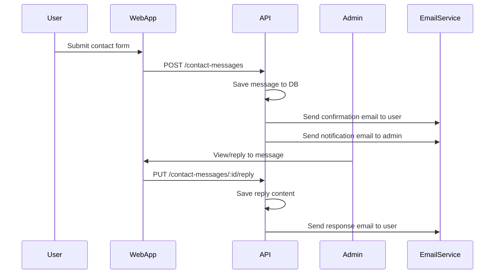

# Contact Message Email Flow

## 1. Overview
The Contact Message feature allows users to send contact/feedback from the website. The system will send a confirmation email to the user and a notification email to the admin. Admins can reply directly from the dashboard, and the system will send a response email to the user.

---

## 2. Detailed Flow

### 2.1. User sends a contact message
- API: `POST /api/v1/contact-messages`
- System:
  - Save the message to the database
  - Send a confirmation email to the user (if email is provided)
  - Send a notification email to the admin

### 2.2. Admin views and replies
- Admin views the message list on the dashboard
- Admin replies directly (API: `PUT /api/v1/contact-messages/:id/reply`)
- System:
  - Save the reply content to the database
  - Send a response email to the user
  - Mark the message as replied

### 2.3. Mark as read/replied
- API: `PUT /api/v1/contact-messages/:id/mark-read`
- API: `PUT /api/v1/contact-messages/:id/mark-replied`

---

## 3. Related Endpoints
- `POST /contact-messages` — Submit a new contact message
- `GET /contact-messages` — Get message list
- `GET /contact-messages/:id` — View details
- `PUT /contact-messages/:id/reply` — Reply to message (and send email)
- `PUT /contact-messages/:id/mark-read` — Mark as read
- `PUT /contact-messages/:id/mark-replied` — Mark as replied
- `DELETE /contact-messages/:id` — Delete message

---

## 4. Email Template Suggestions

### 4.1. Confirmation email to user
```
Subject: [YourSite] We have received your contact message

Hello {{name}},

Thank you for contacting us. We have received your information and will respond as soon as possible.

Your message:
- Subject: {{subject}}
- Content: {{message}}

Best regards,
[YourSite] Support Team
```

### 4.2. Notification email to admin
```
Subject: [YourSite] New contact message from {{name}}

You have received a new contact message:
- Name: {{name}}
- Email: {{email}}
- Subject: {{subject}}
- Content: {{message}}

Please check the dashboard to reply.
```

### 4.3. Reply email to user
```
Subject: [YourSite] Response to your contact message

Hello {{name}},

We have reviewed your message and our response is as follows:

{{reply}}

If you have further questions, please contact us again.

Best regards,
[YourSite] Support Team
```

---

## 5. Implementation Notes
- Use Resend, SendGrid, or a reputable SMTP service to send emails.
- Log email sending (success/failure, time, content).
- Consider adding reCAPTCHA or rate limiting to prevent spam.
- Only admins can view full email and reply.

---

## 6. Mermaid Diagram

