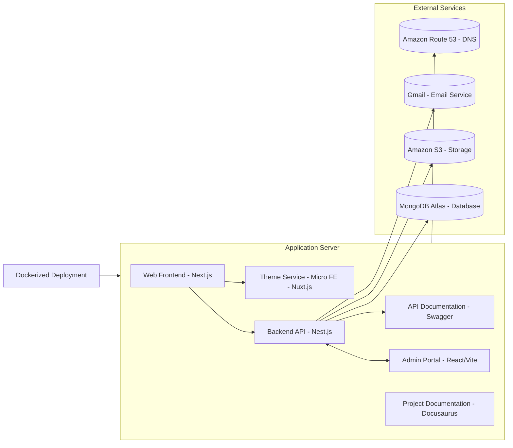

# Welcome to daidev Documentation

**daidev** is a multi-tenant portfolio platform designed to showcase themes, blogs, certificates and contact functionality, with future expansion to support theme sales.

## 🏗️ System Architecture

The daidev platform is built as a modern microservices architecture with the following components:

## 🚀 Quick Start

### For Beginners
If you're new to the daidev project, start with:

- **[Project Architecture Overview](./01-overview/project-architecture-overview)** - Project overview
- **[Monorepo Structure Guide](./01-overview/monorepo-structure-guide)** - Understanding the codebase structure

### For Developers
If you're developing new features:

- **[Auth Implementation Roadmap](./03-implementation/auth-implementation-roadmap)** - Authentication implementation guide
- **[Admin Dashboard Forms Guide](./03-implementation/admin-dashboard-forms-guide)** - Building forms in admin dashboard
- **[Admin Login Flow Guide](./03-implementation/admin-login-flow-guide)** - Complete authentication flow

### For DevOps
If you're responsible for deployment and infrastructure:

- **[Environment Setup Guide](./04-integrations/environment-setup-guide)** - Complete environment configuration
- **[Docker Containerization Guide](./04-integrations/docker-containerization-guide)** - Docker setup and deployment
- **[Deployment Workflows](./06-workflows/deployment-workflows)** - Production deployment guide

## 🏗️ Application Components

The project consists of 7 main applications and services:

### Frontend Applications
1. **Next.js Web App** (`apps/web/`) - Public portfolio with Home, About, Certificates, Themes, Blogs, Contact pages
2. **Nuxt.js Theme Detail** (`apps/theme-detail/`) - Micro frontend for theme detail pages
3. **React Admin Dashboard** (`apps/admin/`) - Admin interface with role-based access (admin/viewer)

### Backend Services
4. **Nest.js Backend API** (`apps/api/`) - REST API with multi-tenancy, JWT auth, and external integrations
5. **Swagger Proxy** (`apps/swagger-proxy/`) - API documentation and testing interface

### Documentation & Assets
6. **Docusaurus Documentation** (`apps/docs/`) - Project documentation and guides
7. **Static Assets** (`apps/assets/`) - CV, templates, images, and web assets

## 🛠️ Tech Stack

### Frontend Technologies
- **Next.js** - React framework for web app with SSR and i18n
- **Nuxt.js** - Vue framework for micro frontend (Theme Detail)
- **React** - UI library for admin dashboard with Context API
- **Tailwind CSS** - Utility-first CSS framework
- **TypeScript** - Type-safe JavaScript
- **Vite** - Build tool for admin dashboard

### Backend Technologies
- **NestJS** - Node.js framework with decorators and dependency injection
- **MongoDB** - NoSQL database with multi-tenancy support
- **Mongoose** - MongoDB ODM for data modeling
- **JWT** - Token-based authentication and authorization
- **bcrypt** - Password hashing and verification

### External Services
- **Cloudinary** - Cloud image management and optimization
- **Resend** - Email service for contact forms
- **Google reCAPTCHA** - Bot protection for forms
- **Google Maps API** - Location services

### DevOps & Infrastructure
- **Docker** - Containerization for all services
- **Docker Compose** - Multi-container orchestration
- **Nginx** - Reverse proxy and load balancer
- **Let's Encrypt** - SSL certificate management
- **Monorepo** - Turborepo for managing multiple apps

## 📚 Documentation Structure

The documentation is organized into 6 main sections:

### 1. **[01-overview/](./01-overview/)** - Project Architecture & Goals
- Project Architecture Overview
- Monorepo Structure Guide
- System Goals and Features

### 2. **[02-design/](./02-design/)** - UI/UX Design & System Architecture
- Admin Dashboard UI Design
- Backend API Architecture
- Frontend Web App Design

### 3. **[03-implementation/](./03-implementation/)** - Implementation Guides
- Admin Dashboard Forms Guide
- Auth Implementation Roadmap
- Admin Login Flow Guide
- Cloudinary Image System
- Multi-tenant Data Architecture

### 4. **[04-integrations/](./04-integrations/)** - API Integrations & External Services
- JWT Auth Authorization Guide
- Cloudinary Upload Process
- Resend Email Workflow
- Docker Containerization Guide
- Environment Setup Guide
- API Documentation Guide
- Web App Integrations
- AI & BFF Integrations

### 5. **[05-troubleshooting/](./05-troubleshooting/)** - Error Handling & Fixes
- Admin Import Functionality Fix
- Admin Routing Issues Fix
- Common Error Solutions

### 6. **[06-workflows/](./06-workflows/)** - Operational Procedures
- Development Workflows
- Deployment Workflows

## 🔍 Key Features

### Multi-Tenancy
- Data isolation per user via `tenantId`
- Secure role-based access control
- Scalable architecture for multiple tenants

### Authentication & Authorization
- JWT-based authentication
- Role-based access (admin/viewer)
- Secure password hashing with bcrypt
- Token expiration and refresh

### Content Management
- CRUD operations for themes, blogs, certificates
- Image upload and management via Cloudinary
- Tag-based categorization system
- Contact form with email notifications

### Modern UI/UX
- Responsive design with Tailwind CSS
- Dark/light mode support
- Internationalization (i18n) - English/Vietnamese
- Progressive Web App features

### DevOps & Deployment
- Docker containerization
- Automated deployment scripts
- SSL certificate management
- Monitoring and health checks

## 🔍 Search

Use the search bar in the top right corner to quickly find the documentation you need.

## 🤝 Contributing

If you find errors or want to improve the documentation, please create an issue or pull request on the GitHub repository.

---

**Start now with [Project Architecture Overview](./01-overview/project-architecture-overview) to understand the project!**
