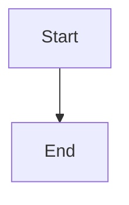
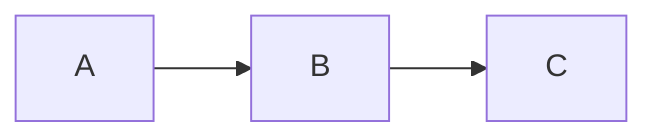

# Basic Mermaid Test

Testing if Mermaid renders correctly.

## Simple Graph

```mermaid
graph TD
    A[Start] --> B[End]
```

## Simple Flowchart

```mermaid
flowchart LR
    A --> B
    B --> C
```

If you see diagrams above (not text), Mermaid is working! 