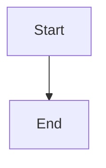
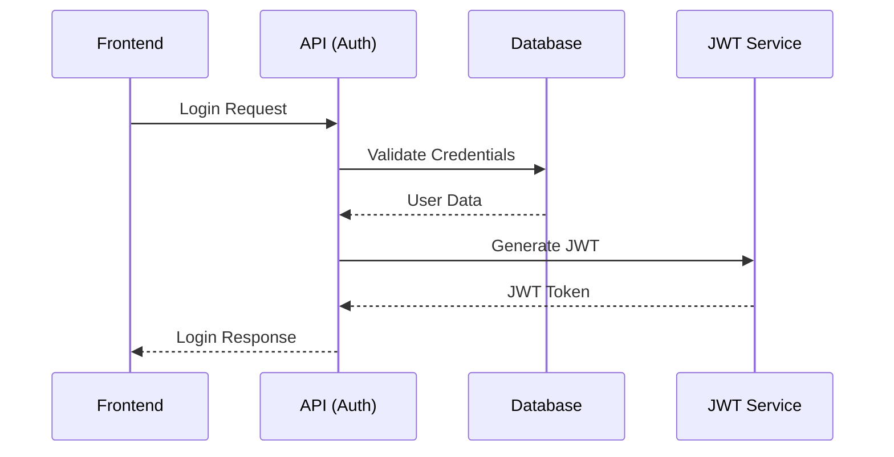
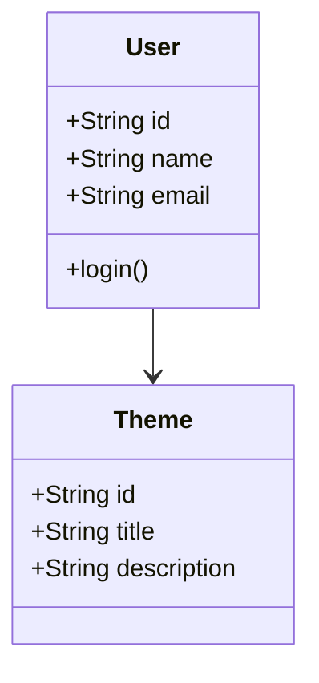
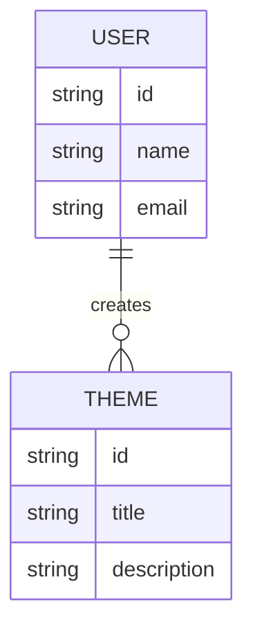
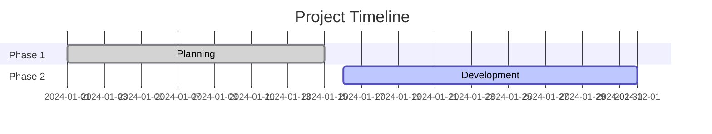

# Fixed Mermaid Test

Testing with correct Mermaid syntax.

## 1. Basic Flowchart

## 2. Your Login Process

## 3. Simple Class Diagram

## 4. Simple ER Diagram

## 5. Simple Gantt

If you see charts above, Mermaid is working correctly! 