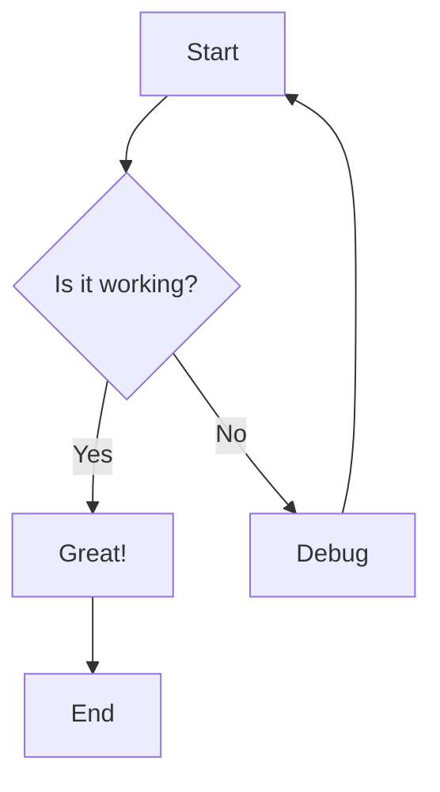
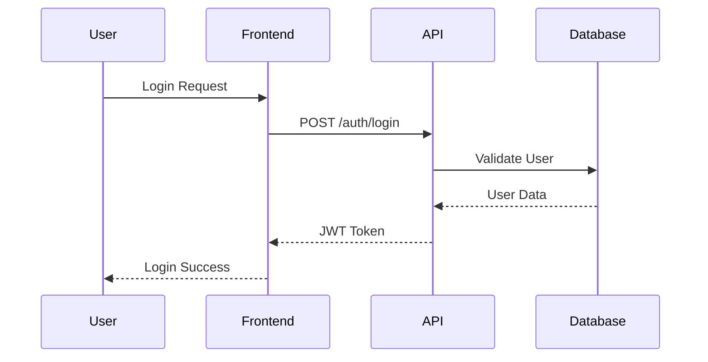
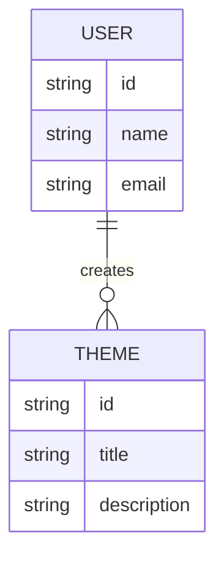
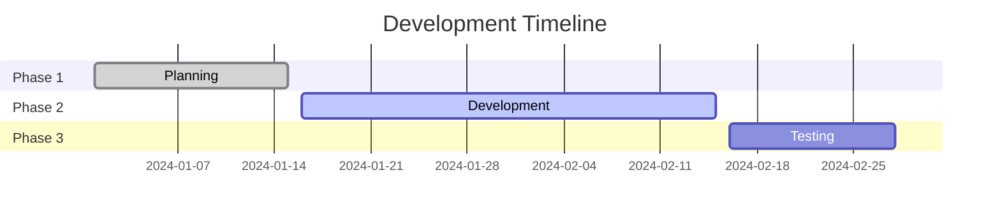

# Rehype Mermaid Test

Testing rehype-mermaid plugin with img-svg strategy.

## 1. Basic Flowchart



## 2. Sequence Diagram



## 3. Class Diagram

```mermaid
classDiagram
    class User {
        +String id
        +String name
        +String email
        +login()
        +logout()
    }
    
    class Theme {
        +String id
        +String title
        +String description
    }
    
    User ||--o{ Theme : creates
```

## 4. ER Diagram



## 5. Gantt Chart



If you see actual chart images above (not text), then rehype-mermaid is working! 🎉