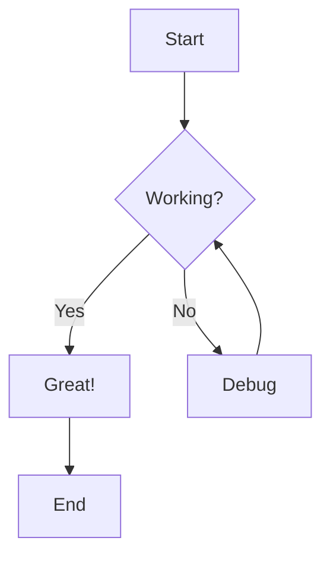
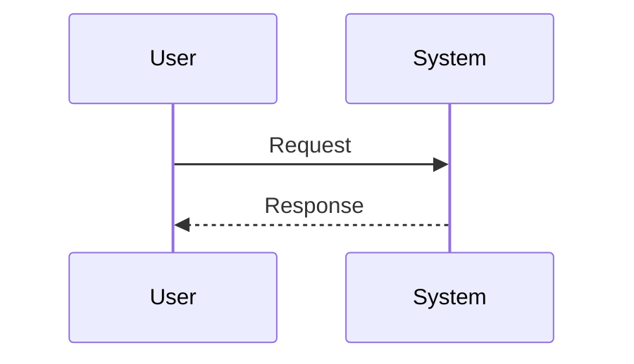

# Simple Mermaid Test

Testing basic Mermaid functionality.

## Flowchart

```mermaid
flowchart TD
    A[Start] --> B{Working?}
    B -->|Yes| C[Great!]
    B -->|No| D[Debug]
    D --> B
    C --> E[End]
```

## Sequence Diagram

```mermaid
sequenceDiagram
    participant U as User
    participant S as System
    U->>S: Request
    S-->>U: Response
```

If you see charts above, Mermaid is working! 