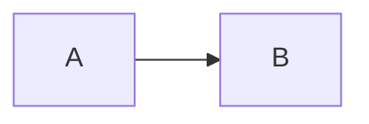
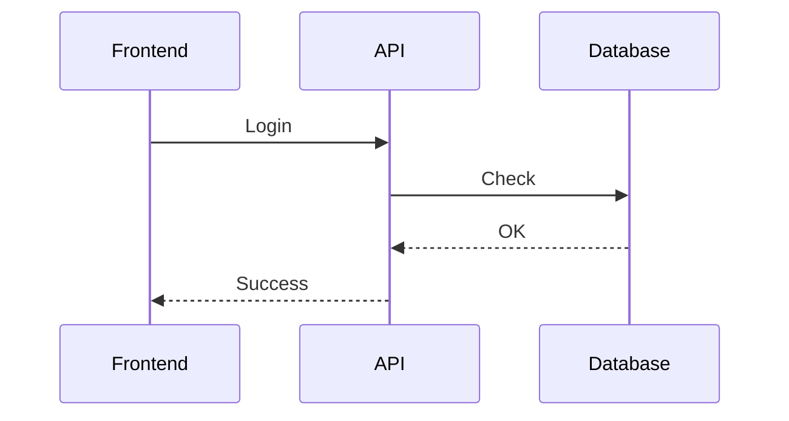
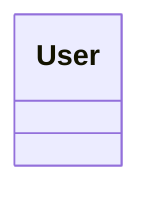

# Simple Mermaid Test

Testing if Mermaid works with simple syntax.

## Test 1: Basic Graph

```mermaid
graph LR
    A --> B
```

## Test 2: Your Login Process

```mermaid
sequenceDiagram
    participant F as Frontend
    participant A as API
    participant D as Database
    
    F->>A: Login
    A->>D: Check
    D-->>A: OK
    A-->>F: Success
```

## Test 3: Simple Class

```mermaid
classDiagram
    class User
```

If you see charts above, Mermaid is working! 