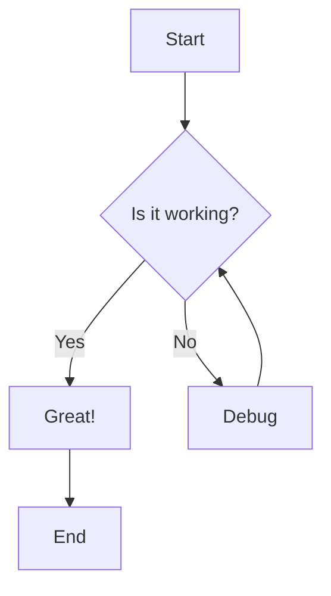
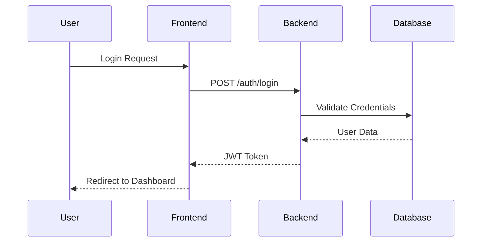
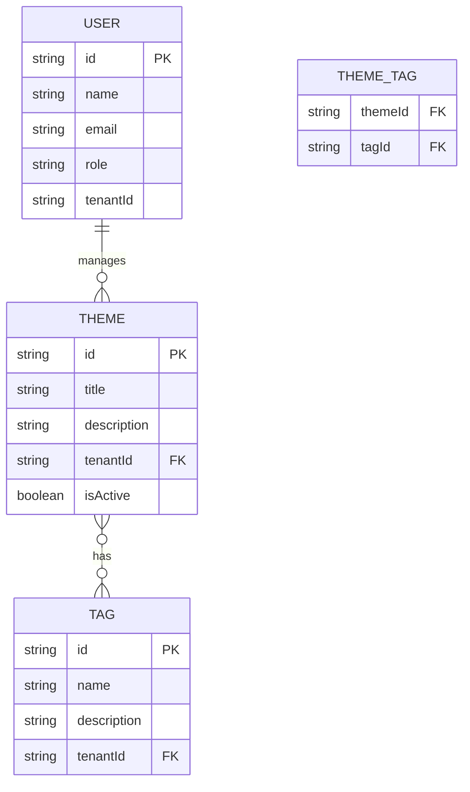
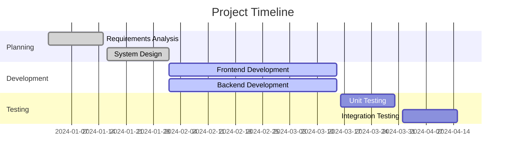
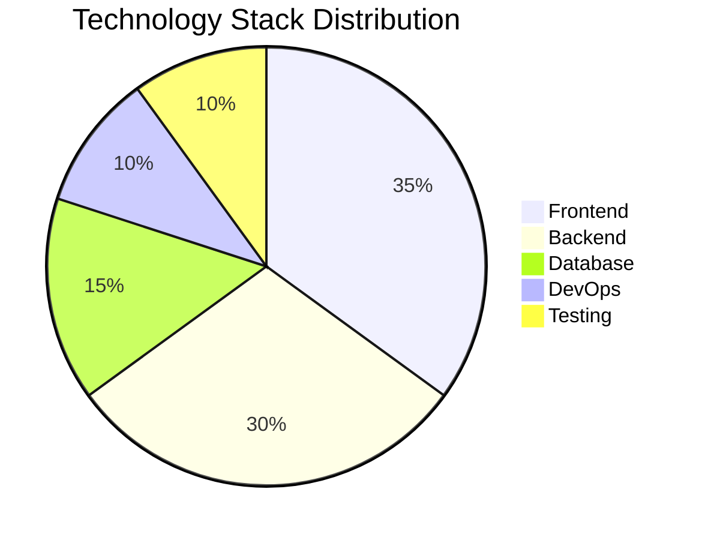
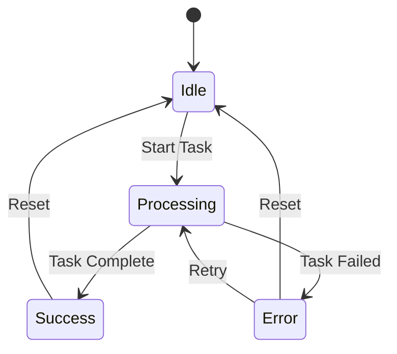
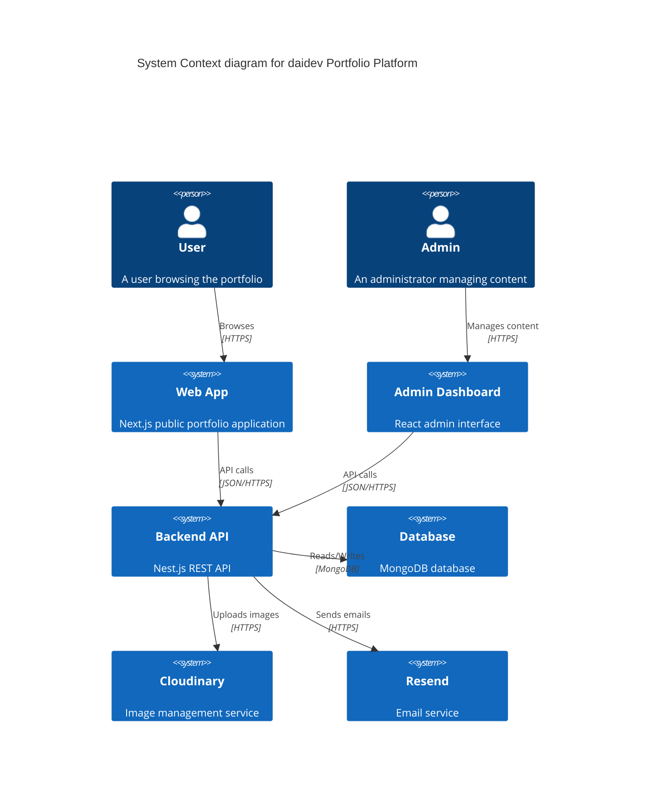
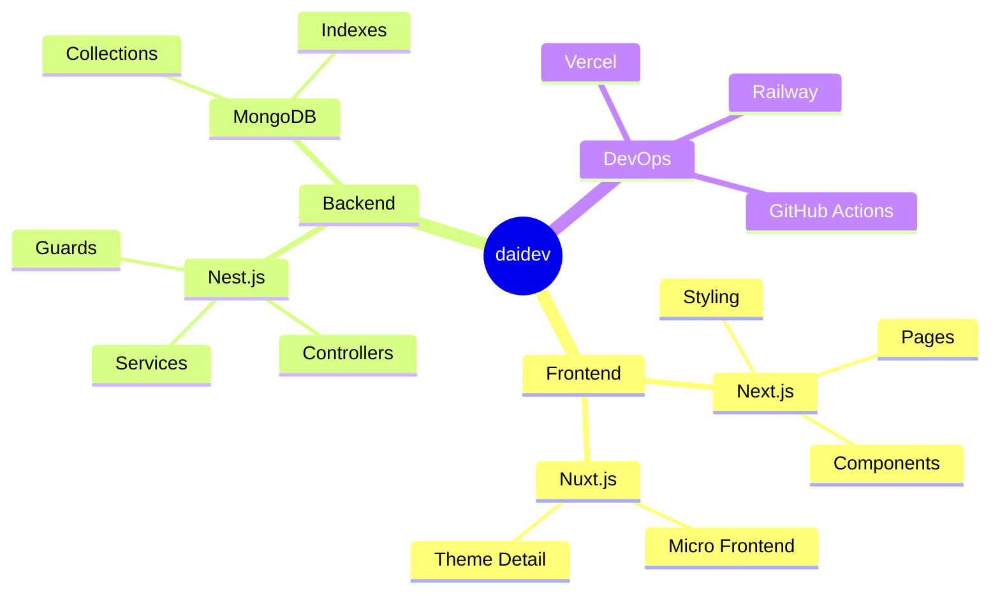
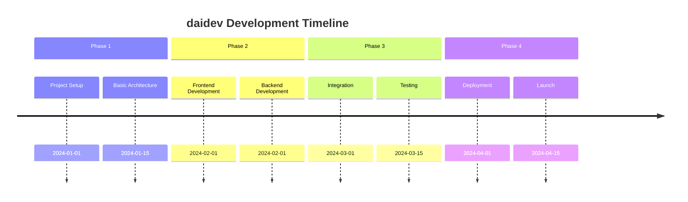
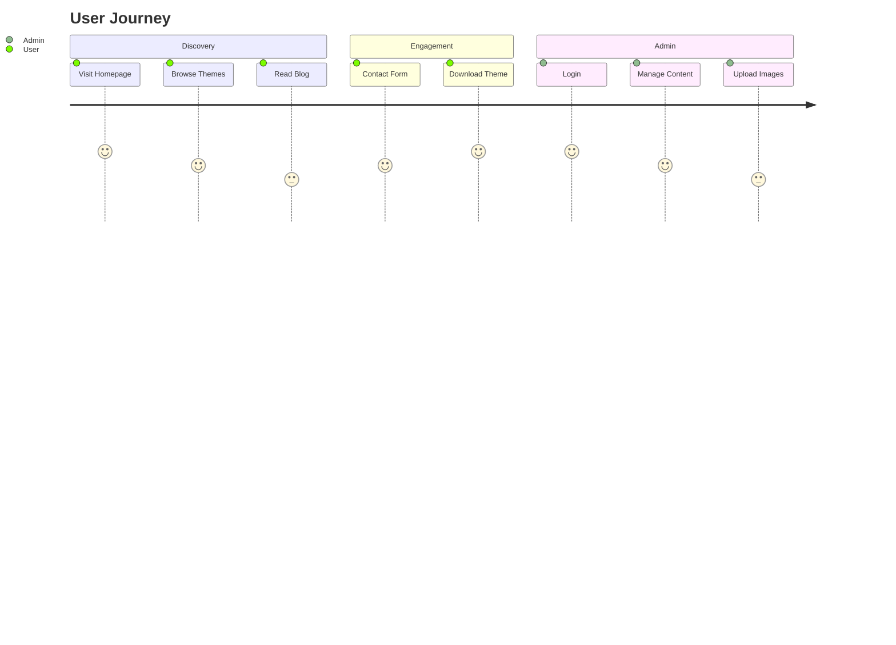

# Mermaid Diagrams Test

This page demonstrates various Mermaid diagrams that should render as charts instead of text.

## Flowchart Example



## Sequence Diagram Example



## Class Diagram Example

```mermaid
classDiagram
    class User {
        +String id
        +String name
        +String email
        +String role
        +login()
        +logout()
    }
    
    class Theme {
        +String id
        +String title
        +String description
        +String[] tags
        +create()
        +update()
        +delete()
    }
    
    User ||--o{ Theme : manages
```
```

## ER Diagram Example


```

## Gantt Chart Example



## Pie Chart Example



## State Diagram Example



## Git Graph Example

```mermaid
gitgraph
    commit
    branch develop
    checkout develop
    commit
    commit
    checkout main
    merge develop
    commit
    commit
```

## C4 Context Diagram



## Mindmap Example



## Timeline Example



## Journey Example



---

## How to Use Mermaid in Docusaurus

To create Mermaid diagrams in your documentation:

1. **Use the mermaid code block syntax:**
   ```markdown
   ```mermaid
   flowchart TD
       A[Start] --> B[End]
   ```
   ```

2. **Supported diagram types:**
   - Flowcharts
   - Sequence diagrams
   - Class diagrams
   - Entity Relationship diagrams
   - Gantt charts
   - Pie charts
   - State diagrams
   - Git graphs
   - C4 diagrams
   - Mindmaps
   - Timelines
   - Journey maps

3. **Themes:**
   - Light mode: Neutral theme
   - Dark mode: Forest theme

The diagrams will automatically render as interactive charts instead of text! 