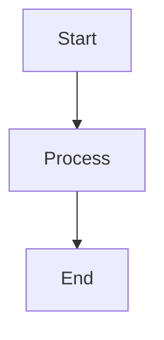
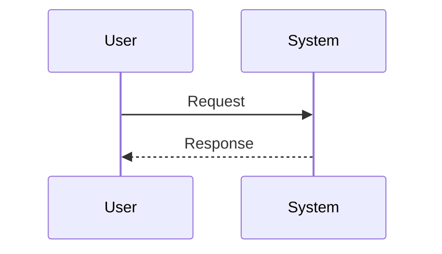
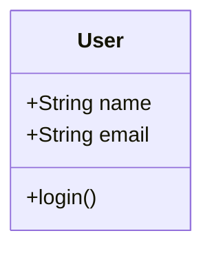

# Mermaid Working Test

Testing if Mermaid diagrams render correctly.

## Basic Flowchart

## Simple Sequence

## Class Diagram

If you see diagrams above (not text), Mermaid is working correctly! 