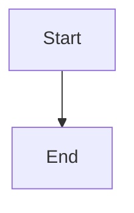
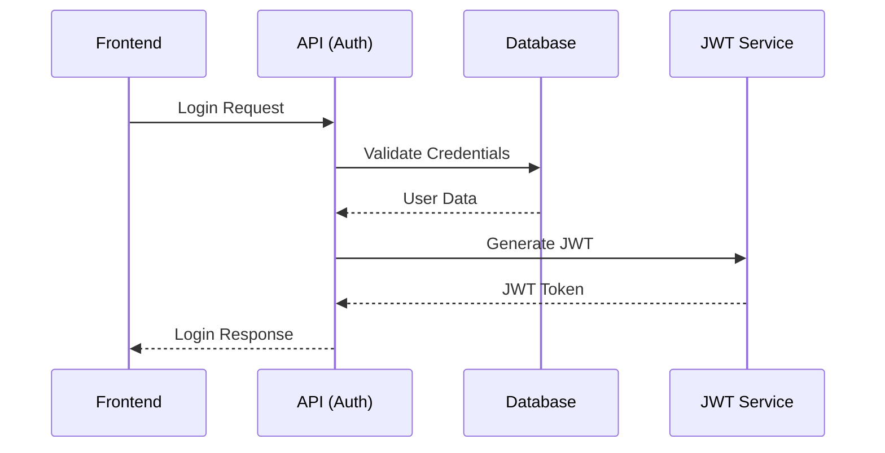
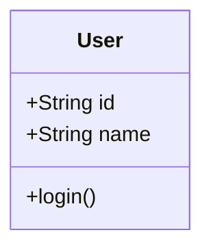

# Simple Mermaid Test

This is a simple test to check if Mermaid is working.

## Basic Flowchart

## Your Login Process

## Simple Class Diagram

If you can see these as charts (not text), then Mermaid is working! 