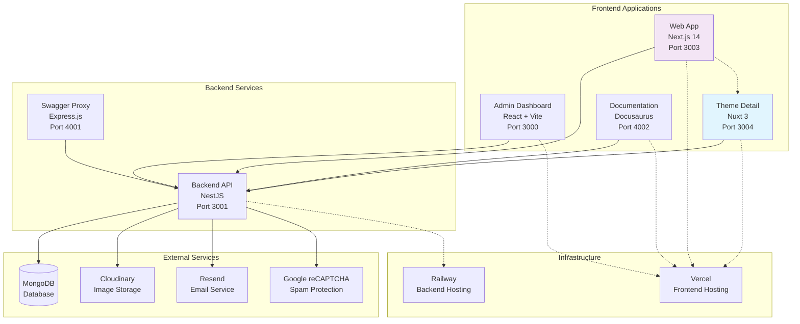

# 🚀 DaiDev - Multi-tenant Portfolio Platform

A comprehensive multi-tenant portfolio platform built with modern web technologies, featuring a public web app, admin dashboard, and robust backend API.

## 📋 Overview

DaiDev is a full-stack portfolio management system designed to showcase personal themes, blogs, certificates, and contact functionality. The platform supports multiple tenants with isolated data and provides a complete content management experience.

### 🏗️ System Architecture

The project follows a **monorepo architecture** with 6 specialized sub-applications:

- **🌐 Web App** - Public portfolio website (Next.js 14)
- **🎛️ Admin Dashboard** - Content management interface (React + Vite)
- **🔧 Backend API** - RESTful API service (NestJS)
- **📚 Documentation** - Technical documentation site (Docusaurus)
- **🎨 Theme Detail** - Micro frontend for theme display (Nuxt 3)
- **📖 Swagger Proxy** - API documentation interface (Express.js)

### 🎯 Key Features

- ✅ **Multi-tenant Architecture** - Isolated data per user
- ✅ **Modern Tech Stack** - Latest frameworks and tools
- ✅ **Internationalization** - English and Vietnamese support
- ✅ **Role-based Access** - Admin and viewer permissions
- ✅ **Image Management** - Cloudinary integration
- ✅ **Email Service** - Resend integration with reCAPTCHA
- ✅ **Responsive Design** - Mobile-first approach
- ✅ **Type Safety** - TypeScript across all applications

## 🏗️ Architecture Diagram



### 🔄 Data Flow

1. **Web App** → **Backend API**: Fetches portfolio data, themes, blogs
2. **Admin Dashboard** → **Backend API**: Manages content, users, settings
3. **Theme Detail** → **Backend API**: Gets theme-specific data
4. **Swagger Proxy** → **Backend API**: Serves API documentation
5. **Backend API** → **External Services**: Handles images, emails, authentication

## 📁 Project Structure

```
daidev/
├── apps/                          # Sub-applications
│   ├── web/                       # Next.js public web app
│   │   ├── src/
│   │   │   ├── app/              # App router pages
│   │   │   ├── components/       # React components
│   │   │   ├── hooks/           # Custom hooks
│   │   │   ├── lib/             # Utilities and API
│   │   │   └── types/           # TypeScript types
│   │   ├── public/              # Static assets
│   │   ├── package.json
│   │   └── next.config.js
│   ├── admin/                    # React admin dashboard
│   │   ├── src/
│   │   │   ├── components/      # UI components
│   │   │   ├── pages/          # Dashboard pages
│   │   │   ├── hooks/          # Custom hooks
│   │   │   └── services/       # API services
│   │   ├── index.html
│   │   ├── package.json
│   │   └── vite.config.ts
│   ├── api/                      # NestJS backend API
│   │   ├── src/
│   │   │   ├── auth/           # Authentication module
│   │   │   ├── users/          # User management
│   │   │   ├── themes/         # Theme management
│   │   │   ├── blogs/          # Blog management
│   │   │   ├── certificates/   # Certificate management
│   │   │   ├── tags/           # Tag system
│   │   │   ├── images/         # Image management
│   │   │   └── contact-messages/ # Contact form
│   │   ├── package.json
│   │   └── nest-cli.json
│   ├── docs/                     # Docusaurus documentation
│   │   ├── docs/               # Documentation content
│   │   ├── src/                # Custom components
│   │   ├── docusaurus.config.ts
│   │   └── package.json
│   ├── theme-detail/            # Nuxt.js micro frontend
│   │   ├── pages/              # Theme detail pages
│   │   ├── components/         # Vue components
│   │   ├── nuxt.config.ts
│   │   └── package.json
│   └── swagger-proxy/           # Express.js API docs
│       ├── swagger-proxy.js
│       └── package.json
├── packages/                     # Shared packages
│   ├── shared/                  # Shared utilities
│   │   ├── types/              # Common TypeScript types
│   │   ├── utils/              # Shared utilities
│   │   └── package.json
│   └── config/                  # Monorepo configuration
│       ├── eslint/             # ESLint configuration
│       ├── typescript/         # TypeScript configuration
│       └── package.json
├── package.json                 # Root package.json
├── pnpm-workspace.yaml         # Workspace configuration
├── turbo.json                  # Turborepo configuration
├── .gitignore                  # Git ignore rules
└── README.md                   # This file
```

## 🛠️ Development Guide

### Prerequisites

- **Node.js** 18.0.0 or higher
- **pnpm** 8.0.0 or higher (recommended)
- **MongoDB** (local or Atlas)
- **External Services**: Cloudinary, Resend, Google reCAPTCHA

### Installation

```bash
# Clone the repository
git clone <repository-url>
cd daidev

# Install dependencies
pnpm install

# Setup environment variables
cp apps/api/env.example apps/api/.env
cp apps/web/.env.example apps/web/.env.local
cp apps/admin/.env.example apps/admin/.env

# Start development servers
pnpm dev
```

### Running Individual Applications

```bash
# Backend API
cd apps/api
pnpm run start:dev

# Web App
cd apps/web
pnpm dev

# Admin Dashboard
cd apps/admin
pnpm dev

# Theme Detail
cd apps/theme-detail
pnpm dev

# Documentation
cd apps/docs
pnpm start

# Swagger Proxy
cd apps/swagger-proxy
pnpm start
```

### Access Points

| Application | URL | Port | Description |
|-------------|-----|------|-------------|
| **Web App** | http://localhost:3003 | 3003 | Public portfolio |
| **Admin Dashboard** | http://localhost:3000 | 3000 | Content management |
| **Backend API** | http://localhost:3001 | 3001 | REST API service |
| **API Docs** | http://localhost:4001 | 4001 | Swagger documentation |
| **Documentation** | http://localhost:4002 | 4002 | Technical docs |
| **Theme Detail** | http://localhost:3004 | 3004 | Theme micro frontend |

### Environment Configuration

#### Backend API (`.env`)
```bash
# Database
DATABASE_URL=mongodb://localhost:27017/daidev

# JWT
JWT_SECRET=your-super-secret-jwt-key
JWT_EXPIRES_IN=7d

# Cloudinary
CLOUDINARY_CLOUD_NAME=your-cloud-name
CLOUDINARY_API_KEY=your-api-key
CLOUDINARY_API_SECRET=your-api-secret

# Email (Resend)
RESEND_API_KEY=your-resend-api-key

# CORS
FRONTEND_URLS=http://localhost:3000,http://localhost:3003,http://localhost:3004

# Port
PORT=3001
```

#### Web App (`.env.local`)
```bash
# API
NEXT_PUBLIC_API_URL=http://localhost:3001/api/v1

# Google reCAPTCHA
NEXT_PUBLIC_RECAPTCHA_SITE_KEY=your-recaptcha-site-key

# Google Maps
NEXT_PUBLIC_GOOGLE_MAPS_API_KEY=your-google-maps-api-key

# i18n
NEXT_PUBLIC_DEFAULT_LOCALE=en
NEXT_PUBLIC_SUPPORTED_LOCALES=en,vi
```

#### Admin Dashboard (`.env`)
```bash
# API
VITE_API_URL=http://localhost:3001/api/v1

# App
VITE_APP_NAME=DaiDev Admin
VITE_APP_VERSION=1.0.0
```

### Database Setup

```bash
# Local MongoDB
brew install mongodb-community
brew services start mongodb-community

# Create database
mongosh
use daidev

# Run seeds
cd apps/api
pnpm run seed
```

### Testing

```bash
# Backend tests
cd apps/api
pnpm run test
pnpm run test:e2e

# Frontend linting
cd apps/web
pnpm run lint

cd apps/admin
pnpm run lint
```

## 🚀 Deployment Guide

### Production Environment

#### Backend Deployment (Railway/Render)
```bash
# Build the application
cd apps/api
pnpm run build

# Set production environment variables
DATABASE_URL=mongodb+srv://...
JWT_SECRET=production-secret
CLOUDINARY_CLOUD_NAME=...
CLOUDINARY_API_KEY=...
CLOUDINARY_API_SECRET=...
RESEND_API_KEY=...
FRONTEND_URLS=https://your-domain.com
```

#### Frontend Deployment (Vercel)
```bash
# Deploy web app
cd apps/web
vercel --prod

# Deploy admin dashboard
cd apps/admin
vercel --prod

# Deploy theme detail
cd apps/theme-detail
vercel --prod

# Deploy documentation
cd apps/docs
vercel --prod
```

### Docker Deployment

#### Backend Dockerfile
```dockerfile
# apps/api/Dockerfile
FROM node:18-alpine

WORKDIR /app

COPY package*.json ./
RUN npm install -g pnpm
RUN pnpm install

COPY . .
RUN pnpm run build

EXPOSE 3001

CMD ["pnpm", "run", "start:prod"]
```

#### Frontend Dockerfile
```dockerfile
# apps/web/Dockerfile
FROM node:18-alpine AS builder

WORKDIR /app
COPY package*.json ./
RUN npm install -g pnpm
RUN pnpm install

COPY . .
RUN pnpm run build

FROM nginx:alpine
COPY --from=builder /app/.next /usr/share/nginx/html
COPY nginx.conf /etc/nginx/nginx.conf

EXPOSE 80
```

### CI/CD Pipeline

#### GitHub Actions
```yaml
# .github/workflows/deploy.yml
name: Deploy

on:
  push:
    branches: [main]

jobs:
  deploy-backend:
    runs-on: ubuntu-latest
    steps:
      - uses: actions/checkout@v3
      - uses: actions/setup-node@v3
        with:
          node-version: '18'
      - run: npm install -g pnpm
      - run: pnpm install
      - run: cd apps/api && pnpm run build
      # Deploy to Railway/Render

  deploy-frontend:
    runs-on: ubuntu-latest
    steps:
      - uses: actions/checkout@v3
      - uses: actions/setup-node@v3
        with:
          node-version: '18'
      - run: npm install -g pnpm
      - run: pnpm install
      - run: cd apps/web && pnpm run build
      # Deploy to Vercel
```

## 🔧 Technology Stack

### Frontend
- **Next.js 14** - React framework for web app
- **React 18** - UI library for admin dashboard
- **Nuxt 3** - Vue framework for micro frontend
- **TypeScript** - Type safety across all apps
- **Tailwind CSS** - Utility-first CSS framework
- **Framer Motion** - Animation library
- **React Query** - Data fetching and caching

### Backend
- **NestJS 10** - Node.js framework
- **MongoDB** - NoSQL database
- **Mongoose** - MongoDB ODM
- **JWT** - Authentication
- **Passport.js** - Authentication strategies
- **class-validator** - Input validation
- **Swagger** - API documentation

### DevOps & Tools
- **Turborepo** - Monorepo management
- **pnpm** - Package manager
- **ESLint** - Code linting
- **Prettier** - Code formatting
- **Docusaurus** - Documentation site
- **Vercel** - Frontend hosting
- **Railway** - Backend hosting

## 🤝 Contributing

### Development Workflow

1. **Fork the repository**
2. **Create a feature branch**
   ```bash
   git checkout -b feature/your-feature-name
   ```
3. **Make your changes**
4. **Run tests and linting**
   ```bash
   pnpm run lint
   pnpm run test
   ```
5. **Commit your changes**
   ```bash
   git commit -m "feat: add your feature description"
   ```
6. **Push to your branch**
   ```bash
   git push origin feature/your-feature-name
   ```
7. **Create a pull request**

### Code Standards

- **TypeScript** - Use TypeScript for all new code
- **ESLint** - Follow ESLint rules
- **Prettier** - Use Prettier for formatting
- **Conventional Commits** - Follow conventional commit format
- **Testing** - Write tests for new features
- **Documentation** - Update documentation for changes

### Branch Naming Convention

- `feature/` - New features
- `fix/` - Bug fixes
- `docs/` - Documentation updates
- `refactor/` - Code refactoring
- `test/` - Adding or updating tests
- `chore/` - Maintenance tasks

## 📚 Documentation

- **[Technical Documentation](./apps/docs/)** - Comprehensive technical guides
- **[API Documentation](http://localhost:4001/)** - Swagger API docs
- **[Updated Documentation](./apps/docs/docs/updated/)** - Latest verified docs

## 🐛 Troubleshooting

### Common Issues

#### Port Already in Use
```bash
# Check what's using the port
lsof -i :3001

# Kill the process
kill -9 <PID>
```

#### Database Connection Issues
```bash
# Check MongoDB status
brew services list | grep mongodb

# Restart MongoDB
brew services restart mongodb-community
```

#### Environment Variables Not Loading
```bash
# Check if .env files exist
ls -la apps/*/.env*

# Verify environment variables
echo $DATABASE_URL
```

### Getting Help

- **Documentation**: Check the [docs](./apps/docs/) folder
- **Issues**: Create an issue in the repository
- **Discussions**: Use GitHub Discussions for questions

## 📄 License

This project is licensed under the MIT License - see the [LICENSE](LICENSE) file for details.

## 🙏 Acknowledgments

- **Next.js** - React framework
- **NestJS** - Node.js framework
- **Tailwind CSS** - CSS framework
- **Docusaurus** - Documentation framework
- **Turborepo** - Monorepo tooling

---

**Built with ❤️ using modern web technologies** 